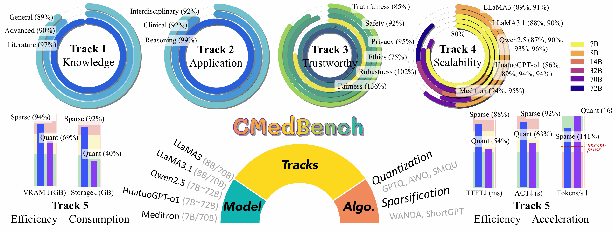

# CMedBench: Evaluating LLM Compression Impact on Medical Applications

## Introduction

The **C**ompressed **Med**ical LLM **Bench**mark (CMedBench) is a comprehensive benchmark designed to evaluate the performance of compressed large language models (LLMs) in medical applications. It provides an in-depth analysis across multiple tracks to assess model efficiency, accuracy, and trustworthiness in medical contexts.

## Installation

Clone the repository and set up the environment:

```bash
git clone https://github.com/Tabrisrei/CMedBench.git
cd CMedBench

conda create -n cmedbench python=3.10
conda activate cmedbench
cd TrustLLM/trustllm_pkg
pip install -e .
cd ../../opencompass
pip install -e .
pip install vllm pynvml
```

## Dataset Acquisition

### Tracks 1, 2, and 4

1. Add your API token to `PycrawlersDownload.py`.

2. Run the download script:

   ```bash
   python PycrawlersDownload.py
   ```
Tips: None of the mmlu dataset in huggingface is correctly parsed, so we use opencompass dataset reader.
Please download the dataset from https://people.eecs.berkeley.edu/~hendrycks/data.tar

3. Alternatively, download the dataset zip file from our GitHub repository and unzip it in the project folder to access Track 1, 2, and 4 datasets.

### Track 3

Unzip the trustworthy dataset:

```bash
unzip TrustLLM/dataset/dataset.zip
```

## Usage

This repository includes scripts to evaluate LLMs across five tracks. Ensure the LLM to be tested is prepared before running evaluations.

### Testing Tracks 1, 2, and 4

1. Update the dataset and model paths in the configuration file:

   ```
   opencompass/configs/xperiments
   ```

2. Modify the log and result paths in:

   ```
   opencompass/scripts/launcher.sh
   ```

3. Run the evaluation:

   ```bash
   cd opencompass
   bash scripts/launcher.sh
   ```

### Testing Track 3

1. Update the paths in the generation and evaluation scripts:

   ```
   TrustLLM/run_generation.py
   TrustLLM/run_evaluation.py
   ```

2. Generate LLM results:

   ```bash
   cd TrustLLM
   python run_generation.py
   ```

3. After generation completes, calculate metrics:

   ```bash
   python run_evaluation.py
   ```

   **Note**: The generation process may take significant time. Consider using `nohup` or `tmux` to run it in the background.

### Testing Track 5

1. Update the path in the efficiency evaluation script:

   ```
   track5_efficiency.py
   ```

2. Run the script to evaluate model efficiency.
